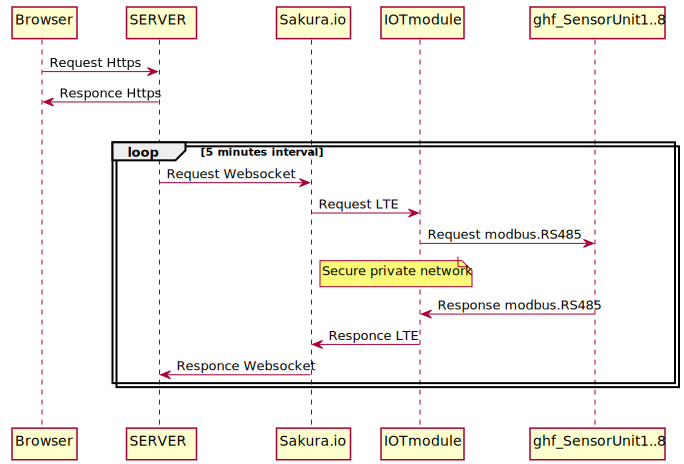

# ghf_sensorhousing
## 農園センサーユニットハウジング
- arduino pro mini
- MH-Z19B 二酸化炭素センサ
- AM2320 温湿度センサー
- リニア照度センサ
- 土壌水分センサ

## 仕組み
iot通信モジュールへRS485で取得データを送ります。
sakura.io + arduino UNO
sakura.ioから、laravel製のグラフで表示します。（作成中）  
  

今後はsigfox,lorawanも利用したいと思います。

## 使用するライブラリ   
(サーバ側)
- nginx, php7
- websocket クライアント　ratchetphp/Pawl
- phpフレームワーク larabel 5.5
- mysql 5.7

(組み込み側)
- nginx, php7
- websocket クライアント　ratchetphp/Pawl
- phpフレームワーク larabel 5.5
- mysql 5.7

## 開発ツール
- 筐体設計 OpenSCAD
- PCB設計 Eagle6.6
- ファームウエア arduino IDE
- エディタはATOM, PlantUML, Netbeans etc.
